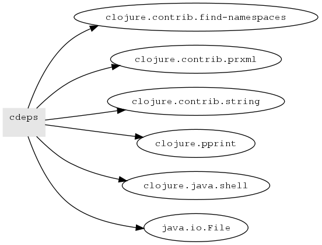

cdeps
=====

Generate namespace or package dependency graphs for Clojure source.

The graph can be generated at various levels - complete src, single ns, single package.

Additionally you can also get the reverse graph of 'what ns/packages dependUpon a ns/package'

The graph is available in many forms - Clojure map, .xml, .dot, .png

Note: for images you need dot (http://www.graphviz.org/) added to your system path. To verify run 'dot -V' on command line.

Try it
=======

To begin clone the repo. Then generate libs and run the repl:

	../cdeps$ lein deps
	...
	../cdeps$ java -cp lib/clojure-1.2.0.jar:lib/clojure-contrib-1.2.0.jar:src clojure.main
	Clojure 1.2.0
 	user=> (require 'cdeps)
	nil
	user=> (def n (cdeps/get-ns-deps "../compojure/src"))
	#'user/n
	user=> (cdeps/show-deps-as-image n)
	Generating xml file tmp/deps736822425291793699.xml ...
	Generating dot file tmp/deps5214394967951933127.dot ...
	Generating image-file tmp/deps4613943607332204272.png ...
	"tmp/deps4613943607332204272.png"
	user=> 

Documentation
=============

For more documentation see autodoc/index.html

For examples see examples/ directory
